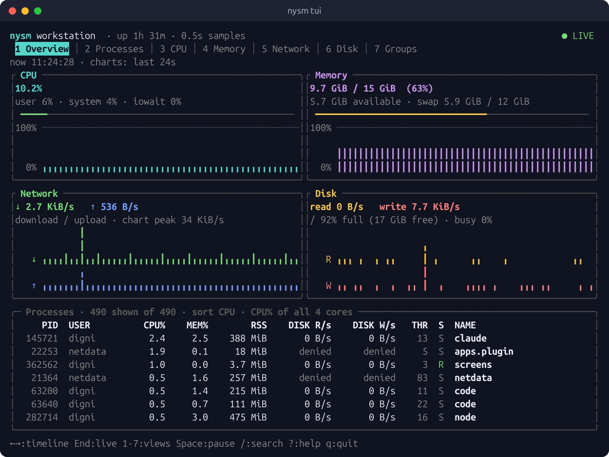

<p align="center">
  
</p>

<h1 align="center">Now You See Me</h1>

<p align="center">
  <b>See what your Linux machine is doing, what changed, and who is responsible.</b><br>
  A precise, lightweight resource monitor for engineers: top bar, desktop app, terminal UI and CLI.
</p>

<p align="center">
  <a href="https://github.com/sheheemmulakkal/now-you-see-me/actions/workflows/ci.yml"></a>
  <a href="https://github.com/sheheemmulakkal/now-you-see-me/releases"></a>
  <a href="#licence"></a>
  
</p>

<p align="center">
  
</p>

Most monitors tell you a number. Now You See Me answers four questions:

1. **What is being used right now?** CPU per core, memory and swap, network,
   disks and filesystems.
2. **What changed in the last minutes?** Every chart covers recent history;
   the terminal UI lets you move back through it sample by sample.
3. **Which process, app or container is responsible?** Including *real*
   memory per app (PSS), not double-counted RSS.
4. **Is work actually waiting?** Pressure stall information (PSI) shows when
   tasks are stalled on CPU, memory or I/O, not just how busy things are.

It runs as a normal user, offline, with no account and no telemetry. A value
that cannot be measured is shown with the reason, never as a made-up `0`.

## Four ways to see it

### In the top bar


CPU, memory, network, how full your disk is and disk activity, always
visible. The width never jumps as values change. Choose what is shown, with
icons, names or both; click for the full app.

### Desktop app

<p>
  
  
</p>

Overview, CPU, memory, network, storage, containers & services, and
processes, in light or dark. Group processes by app to see which program
really uses your memory, select several to watch side by side, and open live
details (open files, threads, memory split). The About page shows what the
app itself costs, measured live.

### Terminal UI, also over SSH



`nysm tui` works from 80×24, in colour or plain ASCII. Monitor another
machine over your existing SSH with `nysm tui --remote user@host`; nothing
listens on the network.

### Scriptable CLI

```console
$ nysm
workstation · Ubuntu 24.04.3 LTS · kernel 7.0.0-34-generic · x86_64 · up 1h 32m
CPU      8.7%  user 6.2  system 2.5  irq 0.0  iowait 0.2  steal 0.0
         load 1.30 4.73 6.63 (1/5/15 min) on 4 logical cores
         pressure some 0.8% now, avg10 0.8%
Memory   9.8 GiB used of 15 GiB (63.7%)  available 5.6 GiB  cache 3.8 GiB
Network  rx 6.0 KiB/s  tx 4.2 KiB/s  [eno1]
Disk I/O read 20 KiB/s  write 236 KiB/s  (4 r/s, 11 w/s)  [nvme0n1, sda]
…
$ nysm net check github.com --count 2
DNS github.com → 20.207.73.82 (48.4 ms)
TCP 20.207.73.82:443
  #1  connected in 28.0 ms
  #2  connected in 19.5 ms
```

Every command has `--json`, streams are JSONL, and exit codes are stable.
`nysm --help` lists them all.

## Install

### Ubuntu and Debian (APT repository, recommended)

Add the signed repository once; updates then arrive with `sudo apt upgrade`:

```sh
sudo install -d -m 0755 /etc/apt/keyrings
curl -fsSL https://sheheemmulakkal.github.io/now-you-see-me/apt/nysm-archive-keyring.gpg \
  | sudo tee /etc/apt/keyrings/nysm-archive-keyring.gpg >/dev/null
echo "deb [signed-by=/etc/apt/keyrings/nysm-archive-keyring.gpg] https://sheheemmulakkal.github.io/now-you-see-me/apt stable main" \
  | sudo tee /etc/apt/sources.list.d/nysm.list
sudo apt update
sudo apt install nysm nysm-tray nysm-desktop
```

The repository is signed with the key
`3DF6 A0A9 326B ECFE A1C5  7B50 4127 009F CA3F C576`
([details](https://sheheemmulakkal.github.io/now-you-see-me/)). To use the
packages without the repository, download the `.deb` files from the
[latest release](https://github.com/sheheemmulakkal/now-you-see-me/releases/latest)
and run `sudo apt install ./nysm*.deb`.

| Package | What it is | Ubuntu |
| --- | --- | --- |
| `nysm` | CLI, terminal UI and collector service; no GUI dependencies | 22.04 and newer |
| `nysm-tray` | Top-bar indicator | 22.04 and newer |
| `nysm-desktop` | GTK 4 desktop app (needs GTK ≥ 4.12) | 24.04 and newer |

Remove with `sudo apt remove nysm-desktop nysm-tray nysm` (and delete
`/etc/apt/sources.list.d/nysm.list` and the keyring file to drop the
repository).

### Any Linux, no root (tarball)

The tarball has static binaries that run on any distribution, and installs
per user into `~/.local`:

```sh
tar -xzf nysm-0.1.1-x86_64-linux.tar.gz
nysm-0.1.1-x86_64-linux/install.sh           # --autostart-tray to start the top bar at login
~/.local/share/nysm/uninstall.sh             # removes exactly what was installed
```

### From source

Rust ≥ 1.88 (the desktop app needs Rust 1.92 and `libgtk-4-dev`):

```sh
cargo build --release                        # nysm and nysm-tray
cargo build --release -p nysm-desktop        # desktop app
```

## Quick start

```sh
nysm                          # one-shot summary
nysm tui                      # live terminal UI (? for keys)
nysm-tray &                   # values in the top bar; click it to open the app
nysm service run &            # optional: one shared collector for everything above
nysm processes --sort mem     # who uses the most memory
nysm record -o build.nysm -- cargo build --release   # exact CPU time and peak memory of a command
```

Shell completions: `nysm completions bash|zsh|fish` (installed by the
packages). Manual pages: `man nysm`, `man nysm-tui`, `man nysm-tray`.

The **[user guide](docs/guide.md)** explains every feature, task by task.

## Features

- **Live system view**: CPU per core with frequency and temperature, memory,
  swap, network per interface, disk throughput, latency and busy time,
  filesystems, and pressure (PSI) for CPU, memory and I/O.
- **Who is responsible**: processes (filter, sort, tree, select and watch,
  live details), memory per app with PSS and USS, containers, systemd services
  and desktop apps against their limits, optional container names, and
  `nysm ports` to find the process behind a port.
- **Over time**: charts of recent history in every view, a timeline cursor in
  the TUI, recordings of the whole system or of one command, and `nysm compare`
  for before/after runs.
- **Alerts** for sustained problems, with hysteresis and cooldown, and
  optional snapshots of the minutes around each alert.
- **Storage insight**: growth trend and time-to-full per filesystem, and a
  bounded, cancellable `nysm disk usage` scan.
- **Diagnostics on demand**: `nysm net check` (DNS and TCP connect time),
  `nysm capabilities` and `nysm doctor`.

## Light on your machine

Measured on an Intel i5-7500 (share of one CPU core, and memory):

| Part | CPU | Memory |
| --- | --- | --- |
| Collector service | 0.2–0.4 % (≈ 0.8 % while a process list is open) | 2 MiB |
| Top bar | 0.03–0.2 % | 3.5 MiB |
| Terminal UI | < 0.1 % | 6.5 MiB |
| Desktop window | ≈ 1–2 % while visible, nothing when minimised | 55 MiB |

Pages you are not looking at are not updated, and the process list is only
scanned while something shows it. Details: [performance](docs/performance.md).

## Privacy

Everything is read locally from `/proc` and `/sys` as your user. Nothing is
sent anywhere unless you ask (`net check`, or `tui --remote` over your own
SSH). Command lines are hidden by default because they can contain
passwords. Container names are opt-in, because the Docker socket is
root-equivalent. See [security and privacy](docs/security.md).

## Documentation

- **Using it:** [user guide](docs/guide.md) · [install](docs/install.md) ·
  [configuration](docs/configuration.md) ·
  [what the numbers mean](docs/metrics.md) · [top bar](docs/tray.md) ·
  [desktop app](docs/desktop.md)
- **Everything else:** [documentation index](docs/README.md) ·
  [changelog](CHANGELOG.md) · [platform support](docs/platform-support.md)

macOS and Windows builds compile and start, but report every metric as
unsupported for now.

## Contributing

Bug reports, measurements from other machines and pull requests are welcome:
see [CONTRIBUTING.md](CONTRIBUTING.md). Please report security issues
privately as described in [SECURITY.md](SECURITY.md). This project follows a
[code of conduct](CODE_OF_CONDUCT.md).

## Licence

Licensed under either of

- Apache License, Version 2.0 ([LICENSE-APACHE](LICENSE-APACHE))
- MIT licence ([LICENSE-MIT](LICENSE-MIT))

at your option. Unless you explicitly state otherwise, any contribution you
intentionally submit for inclusion in this work, as defined in the
Apache-2.0 licence, is dual licensed as above, without any additional terms
or conditions. Third-party components and their licences are listed in
`THIRD-PARTY-LICENSES.txt` in every release.
