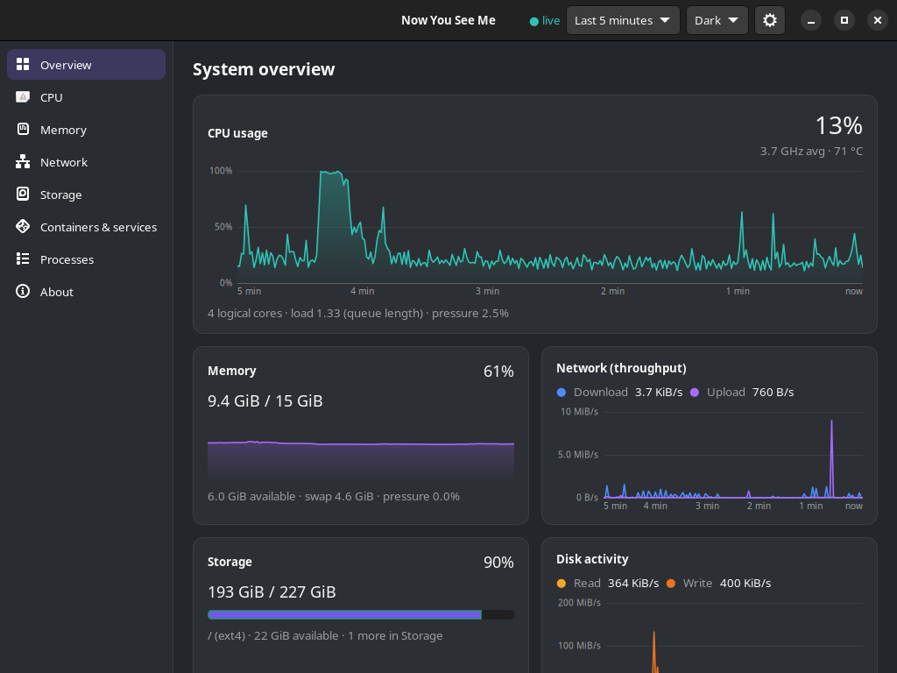

# Now You See Me (`nysm`)

A lightweight, precise resource monitor for engineers. It answers four
questions: **what is being used now, what changed in the last few minutes,
which process or container is responsible, and whether work is actually
waiting** on a resource.

Runs as a normal user, offline, over SSH, with no account and no telemetry.
Values that cannot be measured are shown with the reason, never as a fake `0`.



## Features

- **Live view** of CPU (per core, frequency, temperature), memory, swap,
  network per interface, disks (throughput, latency, busy %) and filesystems,
  with **pressure (PSI)** to show when tasks are *waiting*, not just busy.
- **Who is responsible**: processes (list or tree, filter, pin), containers,
  systemd services and desktop apps against their limits, and which process
  owns a port.
- **Over time**: scrub back through recent history; record the whole system or
  a single command (exact CPU time and peak memory) and compare runs.
- **Alerts** for sustained problems (with hysteresis), and opt-in **incident
  snapshots** of the minutes around each alert.
- **Storage insight**: growth trend and time-to-full per filesystem, and an
  on-demand, bounded `disk usage` scan.
- **Diagnostics on demand**: DNS + TCP connect latency (`net check`),
  `capabilities` and `doctor`.
- **Remote**: monitor another machine over your existing SSH, nothing listening.
- **Scriptable**: `--json` everywhere, JSONL streams, stable exit codes.

## Ways to use it

| | |
| --- | --- |
| `nysm` | one-shot summary and focused commands (`processes`, `ports`, `record`, …) |
| `nysm tui` | interactive terminal UI with charts |
| `nysm-tray` | CPU/memory meter in the top bar (any StatusNotifier desktop) |
| `nysm-desktop` | GTK 4 desktop app |
| `nysm service run` | optional shared collector that all of the above attach to |
| GNOME extension | optional panel indicators |

## Quick start

```sh
tar -xzf nysm-0.1.0-x86_64-linux.tar.gz
nysm-0.1.0-x86_64-linux/install.sh      # per user, into ~/.local, no root
nysm                                    # summary
nysm tui                                # live
nysm-tray &                             # top-bar meter; opens the desktop app
```

Then read the **[user guide](docs/guide.md)**: what every feature does and
how to use it, task by task.

## Build from source

Rust ≥ 1.88 (desktop app: Rust 1.92 and GTK ≥ 4.12 development files).

```sh
cargo build --release                      # nysm and nysm-tray
cargo build --release -p nysm-desktop      # desktop app
scripts/package.sh                         # release tarball (static musl CLI/tray)
scripts/package-deb.sh                     # split .deb packages
cargo test --workspace
```

## Platform support

Linux (x86_64), tested on Ubuntu 24.04, Debian 12 and Alpine 3.21; containers
and VMs report what they can see. macOS and Windows builds compile but report
every metric as unsupported for now. See
[platform support](docs/platform-support.md).

## Documentation

- **Users:** [user guide](docs/guide.md) · [install](docs/install.md) ·
  [configuration](docs/configuration.md) · [what the numbers mean](docs/metrics.md)
- **Everything else:** [documentation index](docs/README.md)

## Licence

Licensed under either of

- Apache License, Version 2.0 ([LICENSE-APACHE](LICENSE-APACHE))
- MIT licence ([LICENSE-MIT](LICENSE-MIT))

at your option. Unless you explicitly state otherwise, any contribution you
intentionally submit for inclusion in this work, as defined in the Apache-2.0
licence, is dual licensed as above, without any additional terms or conditions.

Third-party components are listed with their licences by
`scripts/third_party_licenses.py` (shipped as `THIRD-PARTY-LICENSES.txt`).
