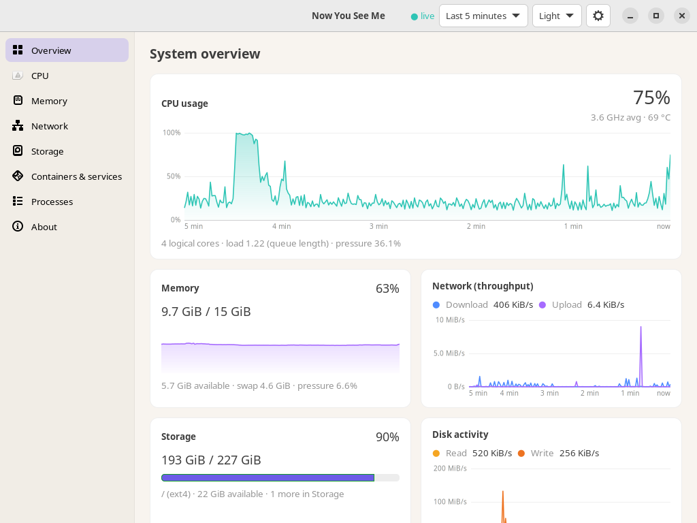

# Desktop app (`nysm-desktop`, GTK4)

Status: **experimental**, implemented and rendered on Ubuntu 24.04
(GTK 4.14, GNOME 46) through a headless broadway display. Not yet used
interactively on a live session by a person; not packaged.

```sh
# needs GTK >= 4.12 development files (Ubuntu: libgtk-4-dev)
cargo build --release -p nysm-desktop
./target/release/nysm-desktop [--attach auto|never|require] [--page overview|processes|cpu|memory|network|storage]
```

It is not a default workspace member, so `cargo build` on a server never
needs GTK. It attaches to `nysm service` when running (shared sampling),
otherwise it runs an embedded collector.

Design follows the reference collage: B (calm overview with cards) for
the layout and D (quiet, warm light theme). Mockup labels that would
misstate a metric were corrected: pressure is never shown as usage, a
temperature is not shown until a sensor module exists, and per-volume
capacity is kept separate from per-device activity.





## Pages
- **Overview**: CPU, memory, network, disk with values, trends and detail
  lines (pressure, load), plus top processes by CPU. Alert banner when a
  rule is firing.
- **Processes**: filter (name/PID/user), sort (CPU, memory, disk I/O, name,
  PID), every process in a virtualized table; activate a row for executable, working directory,
  cgroup and open file descriptors (command line never shown here).
- **Containers & services**: cgroup v2 groups (containers, services,
  apps) with kind filter and sort; collected only while the page is open.
- **CPU / Memory / Network / Storage**: breakdowns, per-core bars with
  frequency, memory categories and pressure history, interfaces, block
  devices, filesystems with capacity bars.

## Controls
- Sidebar with icons: Overview, CPU, Memory, Network, Storage, Processes.
- Header: live/stale indicator, alert count, time range (last 1/5/10
  minutes; history is 10 minutes by default), theme (system/light/dark;
  default from `display.theme` in the config, or `--theme`).

## Behaviour
- Hidden or minimised windows skip all updates; only the visible page is
  updated; the process list is rebuilt only when a new table arrives.
- Follows GNOME's light/dark preference (`org.gnome.desktop.interface
  color-scheme`) without libadwaita. No animations (stack transitions off).
- Charts break at gaps and missing samples, show scale and time span, and
  expose a text summary as their accessible label and tooltip. Series are
  labelled in a legend, not by colour alone.
- If an attached service disappears, it switches to an embedded collector
  and says so.

## Large text (checked 2026-10-06)
Rendered with `gtk-xft-dpi` at 1.5× (144 DPI): all text, cards and tables
scale and nothing overlaps; chart axis labels scale with DPI (10 px at
96 DPI). Pages scroll horizontally when tables are wider than the window
(fixed column widths), so the window no longer has to grow beyond the
screen; verified at 1024 px wide with 1.5× text.
Screen-reader (Orca) testing has not been done.

## Keyboard
| keys | action |
| --- | --- |
| Alt+1 … Alt+7 | Overview, Processes, CPU, Memory, Network, Storage, Containers & services (numbered like the TUI's views 1–7) |
| Ctrl+F | Processes page, focus the filter |
| typing on the Processes page | starts filtering |
| click / arrow keys on a process | live details (refreshed every second) |
| Ctrl/Shift-click, then **Watch** | watch up to 8 processes: CPU and memory charts since watching started |
| Ctrl+, | Settings: network unit, sample interval, history (saved to the config file); top bar: show/hide the tray now, start it at login, choose its items (apply at once) |
| Ctrl+W, Ctrl+Q | close the window |

Checked by hand with real key presses through the broadway web client: Alt+2,
type-to-filter, Ctrl+F, Tab/Enter for details, Ctrl+, and Escape, and Ctrl+W.
Not checked: choosing values in dropdown popups, because broadway does not draw them.

## Measured (reference machine, release, broadway, 30 s, embedded collector)
| visible page | CPU % of one core | RSS |
| --- | --- | --- |
| Overview | 2.8 | 47 MiB |
| Processes (all ~490 processes listed) | 2.0 | 62 MiB |

Broadway (headless) rendering differs from X11/Wayland GL, so treat these
as indicative. The Processes page first cost 6.4 % because it rebuilt
~200 row widgets on every refresh; reusing rows brought it to 2.4 %. It is
now a virtualized GtkColumnView: every process is listed (no 200-row cap),
only the visible rows have widgets, and a refresh updates their text in
place, so scroll position and selection are kept.

## About page
Sidebar → About explains the parts (and which are running now), how data is
collected, how history works, privacy, files and licence, and shows **what
the app costs right now**: CPU and resident memory of each nysm process (the
collector, the tray, every open window) from the live process table, next to
the reference measurements.

## History length
Settings → *Keep history for* takes any number of minutes. Below it the app
shows what that costs (samples, memory in the collector and in each open
window), warns that longer history means more memory and a slightly slower
window open, that history is lost when the collector restarts, and suggests
`nysm record … --interval 10s` for days of data. History is bounded at 16 MiB
(about 44 h at 1 s). The chart range menu offers ranges up to the kept
history, plus "All kept"; long charts draw one point per pixel column (its
peak), so drawing cost does not grow with history.

## Not yet done
- libadwaita (`libadwaita-1-dev` is not installed on the dev machine;
  installing it needs administrator rights); screen-reader testing with
  Orca; a check on a real (non-broadway) session.
