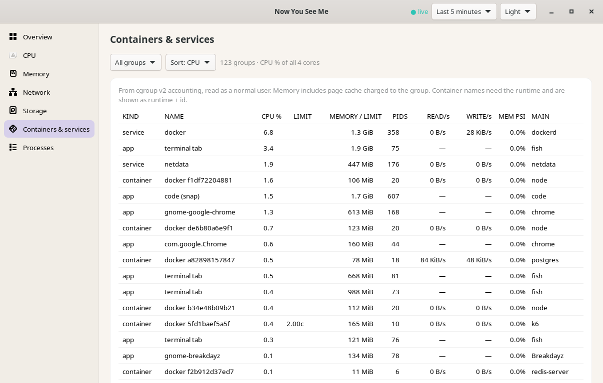

# Containers, services and apps (cgroup v2)

```sh
nysm containers                       # docker/podman/containerd/k8s containers
nysm services --sort mem              # systemd services with unit state
nysm services --failed                # failed system/user units
nysm groups --kind app --limit 10     # desktop apps and user services
nysm groups --json                    # everything, versioned JSON
nysm watch --format jsonl --cgroups   # stream the table
nysm tui  →  7 Groups                 # k cycles the kind filter
```

Desktop: *Containers & services* page (subscribes only while open).



Status: **implemented and verified on Ubuntu 24.04** (cgroup v2, Docker
with 16 containers, ~120 groups).

## How it works
Reads the cgroup v2 hierarchy at `/sys/fs/cgroup` as a normal user. No
container runtime socket, D-Bus or systemd API is used, so nothing gains
extra privileges. Leaf units (`*.service`, `*.scope`) are collected; the
per-user manager (`user@UID.service`) is descended into. Bounds: depth 8,
5000 directories visited, 1000 groups reported (excess counted as
`truncated`). The tree is re-walked every 5th scan, or as soon as a known
group disappears; counters of known groups are read every scan.

| field | source | meaning |
| --- | --- | --- |
| `cpu_pct` | `cpu.stat` usage_usec delta | share of all logical cores, 0–100 |
| `cpu_limit_cores` | `cpu.max` | quota/period in cores; absent = unlimited |
| `memory_bytes` | `memory.current` | charged memory, **including page cache charged to the group** (not RSS) |
| `memory_max_bytes` / `memory_high_bytes` | `memory.max` / `memory.high` | hard limit / throttling threshold; absent = unlimited. Rows ≥ 90 % of the hard limit are highlighted |
| `pids` / `pids_max` | `pids.current` / `pids.max` | task count and limit |
| `disk_io` | `io.stat` rbytes/wbytes deltas | hardware whole disks only (partitions and dm/md are excluded to avoid double counting); `unsupported` when the io controller is not enabled for that subtree (typical for user sessions) |
| `memory_pressure_pct`, `cpu_pressure_pct` | `memory.pressure`, `cpu.pressure` | PSI `some` over the interval for this group |

Kinds and names: `docker-<id>.scope` → `docker <short id>`; also podman
(`libpod-`), containerd/CRI, cri-o and kubepods. `system.slice/*.service`
→ service. User app scopes are named from the unit (systemd escapes
undone, `app-` prefix and instance numbers stripped; snaps → `code
(snap)`; terminal tabs → `terminal tab` with the shell as main process).
The main process is the first PID in the group.

## Limitations
- Container names (`infra-nginx-1`) are shown only with `--names`
  (`nysm containers --names`, `nysm groups --names`): one read-only
  `GET /containers/json` to the Docker socket (`/var/run/docker.sock`) or
  rootless Podman (`$XDG_RUNTIME_DIR/podman/podman.sock`), 3 s timeout,
  8 MiB response cap. Access to those sockets is effectively root-equivalent,
  so nysm never uses them unless asked and never changes group membership.
  Verified against Docker 28.5 on the reference machine.
- Inside a container, `/sys/fs/cgroup` is that container's namespace, so
  only its own subtree is visible.
- cgroup v1-only systems report `unsupported`.
- Logs are not read by nysm; `services --failed` prints the
  `systemctl`/`journalctl` commands to use.

## Optional systemd provider
`nysm services` adds a STATE column (`active/running`, `failed/failed`, …)
and `nysm services --failed` lists failed units of the system and user
managers. It runs `systemctl list-units -o json` once per command with a
3 s timeout (the child is killed on overrun). Without systemd the column
is omitted and `--failed` reports it as unavailable; nothing else changes.
On the reference machine it found a failed user unit
(`update-notifier-crash.service`).

## Cost (reference machine, ~120 groups)
Scan: 13 ms (process scan: 12.5 ms), at the process interval (2 s) and
only while subscribed. `nysm watch --cgroups` measured 1.03 % of one core
vs 0.13 % without, including writing the full table as JSON every second.
