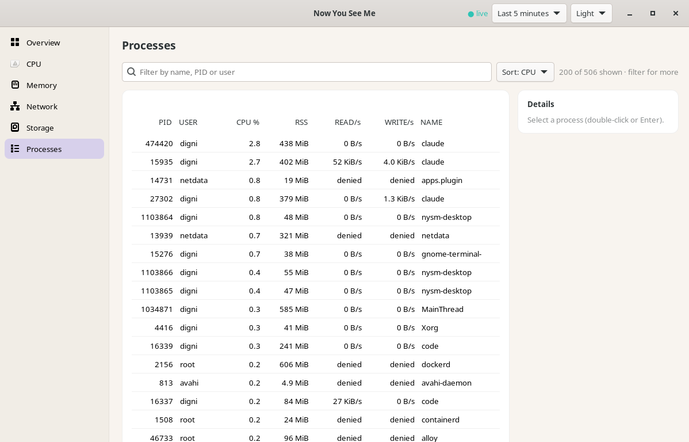
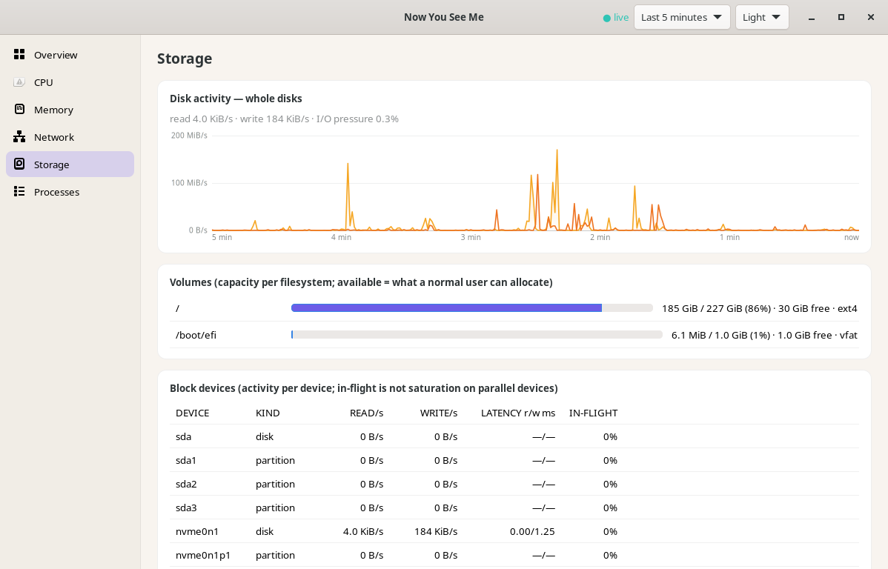

# Now You See Me — user guide

Now You See Me (command `nysm`) shows what your computer is doing: how busy
the CPU, memory, disks and network are right now, what changed in the last
few minutes, **which process or container is responsible**, and whether work
is actually **waiting** on a resource (not just "busy").

It is built for engineers: values are exact where the kernel allows it, and
anything that cannot be measured is shown with the reason, never as a fake
`0`. It runs as a normal user, offline, with no account and no telemetry.

Contents

1. [Ways to use it](#1-ways-to-use-it)
2. [Install and first run](#2-install-and-first-run)
3. [What it can do](#3-what-it-can-do)
4. [How do I…](#4-how-do-i)
5. [The interfaces in detail](#5-the-interfaces-in-detail)
6. [Reading the numbers](#6-reading-the-numbers)
7. [Configuration](#7-configuration)
8. [Privacy and safety](#8-privacy-and-safety)
9. [Troubleshooting](#9-troubleshooting)
10. [What it does not do (yet)](#10-what-it-does-not-do-yet)

---

## 1. Ways to use it

| Interface | Command | Best for |
| --- | --- | --- |
| **Command line** | `nysm summary`, `nysm processes`, … | Quick answers, scripts, servers, JSON output |
| **Terminal UI** | `nysm tui` | Watching live with charts, in a terminal or over SSH |
| **Tray indicator** | `nysm-tray` | An always-visible CPU/memory meter in the top bar |
| **Desktop app** | `nysm-desktop` | A full graphical window with charts and tables (GTK 4) |
| **GNOME extension** | optional | Compact indicators inside GNOME Shell's panel |
| **Collector service** | `nysm service run` | One shared background sampler for all of the above |

All of them show the same measurements. The service is optional: without
it, each window collects for itself. With it running, they all attach to it,
so the machine is sampled once and history is shared.

## 2. Install and first run

Linux x86_64. Per user, no root (details and `.deb` packages:
[install.md](install.md)):

```sh
tar -xzf nysm-0.1.0-x86_64-linux.tar.gz
nysm-0.1.0-x86_64-linux/install.sh        # installs into ~/.local
nysm                                      # first look: a one-shot summary
```

`nysm` and `nysm-tray` are static binaries that run on any Linux of that
architecture. `nysm-desktop` needs GTK ≥ 4.12 (Ubuntu 24.04 or newer).

Suggested setup for a desktop:

```sh
nysm service run &        # optional shared collector (or: install.sh --service-unit)
nysm-tray &               # meter in the top bar; click it to open the desktop app
```

Nothing starts automatically unless you ask for it: `install.sh
--autostart-tray` starts the tray at login, and `install.sh --service-unit`
writes a systemd *user* unit that you enable yourself. Uninstall with
`~/.local/share/nysm/uninstall.sh`.

## 3. What it can do

### Live system view
- **CPU**: total and per core, user/system/iowait/steal split, frequency,
  load average, **CPU pressure** (time tasks waited for a CPU), temperature.
- **Memory**: used, available, cache, swap, **memory pressure** (time tasks
  stalled reclaiming memory).
- **Network**: download/upload per interface and total (physical interfaces
  only, so traffic is not counted twice), packets, errors and drops.
- **Storage**: read/write throughput, IOPS, latency and busy % per disk;
  **I/O pressure**; every mounted filesystem with used/free space and a
  **growth trend** ("+3 GiB/h, full in ~9 h").
- **Sensors**: temperatures, fans, batteries, GPU (where the kernel exposes them).
- **History**: the last minutes are kept in memory; charts in the TUI and desktop
  app can be scrubbed back in time.

### Who is responsible
- **Processes**: CPU, memory, disk I/O per process, sortable and filterable,
  as a list or a parent/child tree. Processes are tracked by PID *and* start
  time, so a reused PID is never confused with the old process.
- **Process details**: executable, working directory, cgroup ("belongs to
  service docker"), open files and sockets. The command line is hidden
  unless you ask for it (it can contain secrets).
- **Pinning**: keep a detailed CPU/memory history for chosen processes.
- **Containers, services and apps**: resource use per Docker/Podman container,
  systemd service and desktop app (cgroup v2), compared with their limits;
  failed systemd units.
- **Ports**: which process listens on, or is connected to, a port.

### Over time
- **Recordings**: record the whole system for a period, or record one command
  (e.g. a build) with its exact CPU time and peak memory.
- **Compare**: summarise a recording, or compare two (before/after a change),
  with noise-aware observations.
- **Alerts**: rules that fire only when a condition *lasts* (e.g. memory
  pressure > 10 % for 30 s), with hysteresis and cooldown, so they do not flap.
- **Incident snapshots** (opt-in): when an alert fires, the service saves a
  recording of the minutes before and after it, for later analysis.

### On demand diagnostics
- **`nysm net check HOST`**: DNS resolution time and TCP connect latency.
- **`nysm disk usage PATH`**: what is taking the space under a directory
  (bounded, cancellable, never a surprise full-disk crawl).

### Anywhere
- **Remote**: `nysm tui --remote user@host` monitors another machine over your
  normal SSH. Nothing listens on the network.
- **Scripting**: every command has `--json` (versioned schema); `watch
  --format jsonl` streams samples.
- **Self-diagnosis**: `nysm capabilities` lists what this machine can and cannot
  report, and why; `nysm doctor` checks the environment, privileges and data sources.

## 4. How do I…

### …see what is happening right now?
```sh
nysm                     # one-shot summary: CPU, memory, network, disks, top processes
nysm tui                 # live, interactive
nysm watch               # one line per second, until Ctrl-C
```

### …find what is slowing my machine down?
1. Look at **pressure** first (`nysm`, or the TUI overview). CPU pressure
   means tasks are waiting for a CPU; memory pressure means the system is
   reclaiming memory instead of working; I/O pressure means tasks wait on
   disk. A machine can be 100 % busy with zero pressure (fine) or 40 % busy
   with high I/O pressure (slow).
2. Find the cause:
   ```sh
   nysm processes --sort cpu         # or mem, io
   nysm processes --filter chrome    # one application
   nysm services                     # by systemd service
   nysm containers                   # by container
   ```
   In the TUI press `2` for processes, then `c`/`m`/`d` to sort, `t` for a
   tree, `/` to filter.
3. Look closer at one process: `nysm inspect --pid 1234` (TUI: select it and
   press `Enter`; desktop: double-click it).

### …find which app uses the most memory?
Processes page → sort by memory and turn on **Group by app**: one row per
program (e.g. "chrome × 36") with summed CPU, MEM % and disk. Select a group to
see its **real** memory: RSS sums count shared libraries once per process and
overstate (Chrome: 4.8 GiB RSS sum vs 1.8 GiB real), so the details panel adds
the PSS total (shared pages split fairly between processes) and the private
part (USS, what closing the app would free). A single process shows the same
split; `nysm inspect --pid N` prints it too.

### …watch one or more processes over time?
In the desktop app, select processes on the Processes page (Ctrl/Shift-click
for several) and press **Watch**: each gets a tile with live CPU and memory
charts, kept even when it drops out of the top of the list or exits (up to 8).
In the TUI, select a process and press `*`. Selecting a single process also
shows its details, refreshed every second: state, parent, CPU, memory, threads,
disk, open file descriptors (files, sockets, pipes) against the process's
limit (`ulimit -n`), swap, and where it belongs.

### …find who is using a port?
```sh
nysm ports --port 3000          # listening sockets and their processes
nysm ports --port 5432 --all    # also connected sockets
```
Processes of other users show as "permission denied" unless you run as
that user (or root).

### …check containers and services?
```sh
nysm containers --names         # --names asks Docker/Podman for names (opt-in)
nysm services                   # CPU/memory/IO per service with unit state
nysm services --failed          # failed systemd units
```
The TUI (`7`, then `k` to cycle kinds) and the desktop app ("Containers &
services") show the same live, with memory against each limit. In the desktop
app, the **Container names** switch shows real names (`infra-api-1`) instead of
`docker <id>`; it is off by default because the Docker socket is root-equivalent.

### …know whether my disk is filling up, and with what?
- The Disk view (TUI `6`, desktop "Storage") shows each filesystem with a
  **TREND** after about 2 minutes: growth per hour and, if it keeps growing,
  roughly when it will be full. It is a projection at the current rate, not a
  prediction.
- Find what uses the space:
  ```sh
  nysm disk usage ~/projects          # largest entries first
  nysm disk usage / --timeout 30s     # bounded; Ctrl-C stops early
  ```
  Sizes are real disk usage; hard links are counted once; symlinks are not
  followed; other filesystems are skipped unless `--cross-filesystems`.

### …check whether a server is reachable?
```sh
nysm net check example.com            # port 443
nysm net check db.internal:5432 --count 10
```
Reports DNS time and TCP connect time (min/avg/max). It does not use ping
(that needs privileges) and it sends no data.

### …measure a build or test run, and compare before/after?
```sh
nysm record -o before.nysm -- cargo build --release     # records one command
# …change something…
nysm record -o after.nysm -- cargo build --release
nysm compare before.nysm after.nysm
```
Wall time, CPU time and the largest process's peak memory are **exact**
(from the kernel when the command exits); everything else is sampled and
labelled as such. Record the whole system instead with
`nysm record -o idle.nysm --duration 60s`. Details: [recordings.md](recordings.md).

### …get warned when something goes wrong?
Built-in rules: filesystem nearly full, sustained memory pressure, sustained
I/O pressure. See them with `nysm alerts --list`.

- Firing alerts show as a red marker on the tray icon, a banner in the TUI and desktop app,
  and as events in `nysm alerts` (or `--format jsonl` for scripts).
- Add or change rules in the config file ([alerts.md](alerts.md)).
- Turn on incident snapshots to keep the data around each alert:
  set `[incidents] enabled = true` in the config, run `nysm service run`,
  then list them with `nysm incidents` and open one with `nysm compare
  FILE` ([incidents.md](incidents.md)).

There are no pop-up desktop notifications.

### …monitor another machine?
Install `nysm` on it, then from your machine:
```sh
nysm tui --remote user@server
nysm tui --remote user@server --remote-nysm ~/.local/bin/nysm   # if not in PATH there
```
This uses your SSH config, keys and host-key checks. The remote side runs
only while you are connected and opens no port ([remote.md](remote.md)).

### …use it from scripts?
```sh
nysm summary --json | jq '.memory.usage'
nysm watch --format jsonl --interval 5s --count 12 > five-minutes.jsonl
nysm processes --sort mem --limit 5 --json
```
Every value is wrapped with a status, so a script can tell "0" from "could
not be measured". Exit codes: `0` ok, `1` failure, `2` bad usage, `3` output
produced but CPU/memory failed, `4` target not found.

### …see what this machine supports?
```sh
nysm capabilities      # every metric: available / unsupported / permission denied, and why
nysm doctor            # environment, privileges, every data source, sampling cost
nysm service status    # is the shared collector running?
nysm config check      # is the config file valid?
```

## 5. The interfaces in detail

### Terminal UI (`nysm tui`)
Views: `1` Overview · `2` Processes · `3` CPU · `4` Memory · `5` Network ·
`6` Disk · `7` Containers & services. `Tab` / `Shift-Tab` cycle.

| Key | Action |
| --- | --- |
| `Space` or `p` | pause the display (collection continues) |
| `←` `→` (`h` `l`) | move back/forward in time on all charts; `End`/`Esc` back to live |
| `↑` `↓` (`j` `k`), `PgUp` `PgDn`, `g` `G` | move in lists |
| `Enter` | details of the selected process |
| `*` | pin / unpin the selected process |
| `/` | filter by name, PID or user (`Esc` clears) |
| `c` `m` `d` `n` `P` | sort by CPU, memory, disk I/O, name, PID |
| `t` | process tree |
| `k` (view 7) | cycle all / containers / services / apps |
| `?` | help |
| `q` | quit |

Options: `--interval 2s`, `--ascii` (no Unicode), `--max-fps 5`,
`--attach never` (ignore the service). Works from 80×24; `NO_COLOR` gives
monochrome.

### Tray (`nysm-tray`)
Icons with live values in the top bar: CPU `24%`, memory `6.2G`, network
`↓1.8M ↑240K`, storage used `87%` (how full `/` is) and disk activity `12%`. Choose what is shown from its menu
(*Show in top bar*, including disk read/write); the choice is saved. `--meter`
gives one compact two-bar icon; `--no-label` icons only. Hovering any item
shows the full summary. A `⚠` appears while an alert fires. Text in the bar needs
Ubuntu's AppIndicator host; other desktops show the icons.
Hover for exact values; open its menu for CPU, memory, network, disk,
pressure and temperature lines, firing alerts, the data source and "Open
monitor" (starts the desktop app). Works on Ubuntu GNOME (built-in AppIndicator support), KDE,
XFCE and other StatusNotifier desktops ([tray.md](tray.md)).

### Desktop app (`nysm-desktop`)
Pages: Overview, CPU, Memory, Network, Storage, Containers & services,
Processes. Header: live/stale status, chart time range, theme, settings.

| Key | Action |
| --- | --- |
| `Alt+1` … `Alt+7` | pages, numbered like the TUI views |
| `Ctrl+F` | process filter (or just start typing on the Processes page) |
| click / arrow keys | live details of the selected process (every second) |
| Ctrl/Shift-click, then **Watch** | watch up to 8 processes with CPU and memory charts |
| `Ctrl+,` | settings (network unit, sampling interval, history length) |
| `Ctrl+W`, `Ctrl+Q` | close |

Pages that are not visible are not updated, so the app stays light in the
background ([desktop.md](desktop.md)).





### GNOME Shell extension (optional)
Compact CPU/memory/network text in the GNOME panel, fed by the collector
service. Most users should use the tray instead; the extension is for GNOME
setups without AppIndicator support ([gnome-extension.md](gnome-extension.md)).

### Collector service
```sh
nysm service run       # foreground; use & or a systemd user unit
nysm service status
nysm service stop
nysm service unit      # print a systemd user unit (not installed or enabled)
```
It listens only on a private socket in your runtime directory (mode 0600).
TUI, tray, desktop and extension attach automatically when it runs.

## 6. Reading the numbers

- **CPU %** is a share of *all* cores (0–100 %). In process lists, `--per-core`
  switches to the "100 % = one core" scale used by `top`.
- **Memory used** is total minus *available*; reclaimable cache counts as
  available.
- **Pressure** is the share of time tasks were stalled waiting, not utilisation.
  Sustained values above a few percent are worth a look.
- **Network** rates default to bytes per second with binary units (KiB/s);
  `--rate-unit bits` or the settings switch to bits per second (kb/s, Mb/s).
- **`—` with a reason** means the value could not be measured: *warming up*
  (rates need two samples), *permission denied* (another user's process),
  *unsupported* (this kernel or machine does not provide it), *stale*, or
  *error*. It is never shown as 0.

Exact definitions and sources: [metrics.md](metrics.md).

## 7. Configuration

Optional; defaults work. The file is `~/.config/nysm/config.toml`.

```sh
nysm config init                        # write a commented default file
nysm config set sampling.interval 2s    # change one value (keeps your comments)
nysm config show                        # effective settings
nysm config check                       # validate
```
Covers sampling intervals and history length, network unit, theme, alert
rules and incident capture. Invalid files are reported and defaults are used;
nothing overwrites a file it cannot parse ([configuration.md](configuration.md)).

## 8. Privacy and safety

- No network access except what you explicitly ask for (`net check`,
  `--remote` over your SSH). No telemetry, no accounts.
- Runs as a normal user; it never asks for root. Other users' process
  details simply show as "permission denied".
- Command lines are hidden by default (they can contain passwords or
  tokens): `inspect --show-args` and `record --store-args` opt in.
- Recordings, incidents and the config are written with owner-only permissions.
- Docker/Podman names are opt-in (`--names`), because that socket grants broad
  privileges.

Details: [security.md](security.md).

## 9. Troubleshooting

| Problem | What to do |
| --- | --- |
| A value shows `— (permission denied)` | Expected for other users' processes. Run as that user if you need it. |
| `— (unsupported)` for pressure or temperatures | The kernel or hardware does not provide it; `nysm capabilities` explains. |
| No tray icon | Your desktop needs StatusNotifier/AppIndicator support (built into Ubuntu). On plain GNOME install the "AppIndicator and KStatusNotifierItem Support" extension, or use the desktop app or TUI. |
| Desktop app does not start | Needs GTK ≥ 4.12 (Ubuntu 24.04+). The CLI, TUI and tray work everywhere. |
| TUI/tray say "collected locally" | No service is running; start `nysm service run` to share one collector. |
| `--remote` fails with "command not found" | Pass `--remote-nysm ~/.local/bin/nysm` (non-interactive SSH often lacks `~/.local/bin` in `PATH`). |
| Config ignored | `nysm config check` shows the error; defaults are used until it is fixed. |
| Anything else | `nysm doctor` |

## 10. What it does not do (yet)

- Linux only for now. macOS and Windows builds compile but report every
  metric as unsupported ([platform-support.md](platform-support.md)).
- No per-process network bandwidth (system and per-interface rates only).
- No NVIDIA/Intel GPU utilisation (only what the kernel's DRM interface shows).
- No pop-up desktop notifications for alerts.
- No long-term database: history lives in memory; use `record` to keep data.
- No ICMP ping, bandwidth tests or packet capture.

Planned work is tracked in the [roadmap](roadmap.md).
